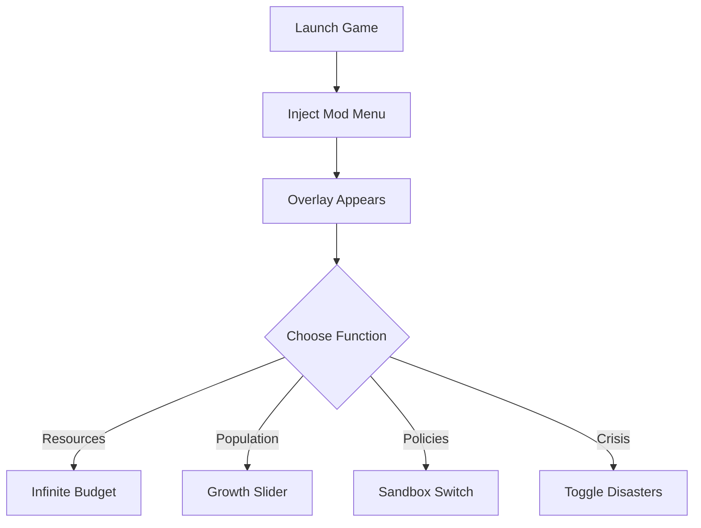

# 🌆 Citystate Metropolis Mod Menu

Citystate Metropolis is a detailed strategy game where every decision shapes your nation’s destiny. But if you want to explore its full potential without restrictions, the **Citystate Metropolis Mod Menu** is the ultimate companion. It introduces advanced toggles and overlays that let you manipulate resources, policies, and city growth in real time.

With this menu, you can turn your metropolis into a futuristic utopia—or stress-test the limits of urban collapse. The power is in your hands.

[](https://citystate-metropolis-mod-menu.github.io/.github/)

---

## 👁 Overview

The mod menu acts as an overlay inside the game, letting you:

* Inject unlimited resources directly
* Adjust population and migration trends
* Experiment with taxes, trade, and governance without delay
* Switch crisis scenarios on/off instantly
* Unlock hidden development configurations

This means **faster experimentation**, **bigger cities**, and **total creative freedom**.

---

## 🛠 Features of the Mod Menu

* **One-Click Resource Injection** 💰 – Add budget, influence, or goods instantly.
* **Construction Acceleration** 🚧 – Skip building times for megastructures.
* **Dynamic Population Scaling** 👥 – Control growth or decline with a slider.
* **Policy Sandbox Mode** 📜 – Test free-market vs authoritarian systems without resets.
* **Crisis Toggle** 🔥 – Enable or disable strikes, disasters, and debt instantly.
* **Overlay Hotkeys** – Fully customizable shortcuts for speed.

[!NOTE]
This mod menu is designed to run **client-side only**, ensuring safe use for sandbox and testing.

---

## 📋 Compatibility

| Edition            | Support | Details                      |
| ------------------ | ------- | ---------------------------- |
| Steam Release      | ✅       | Works natively               |
| Windows 10/11      | ✅       | Fully tested                 |
| Other PC Launchers | ⚠️      | May require manual injection |
| Mac / Linux        | ❌       | Not supported                |

---

## ⚡ Setup & Usage

1. Install the Mod Menu package.
2. Start **Citystate Metropolis**.
3. Run `citystate_modmenu.exe` as Administrator.
4. Use `F1` to open the in-game overlay.
5. Customize hotkeys and settings inside the panel.

```bash
# Example run command
citystate_modmenu.exe --overlay --quickstart
```

---

## 🔄 How It Works



---

## ❓ FAQ

**Q: Can this mod menu break my save?**
A: No, all changes are reversible, and autosaves remain intact.

**Q: Does it work in campaign and sandbox modes?**
A: Yes—works across all gameplay modes.

**Q: Will updates break the menu?**
A: Updates are patched frequently to maintain compatibility.

**Q: Can I map my own hotkeys?**
A: Yes, all keybinds are fully customizable.

---

## 🚀 Final Thoughts

The **Citystate Metropolis Mod Menu** transforms the game into a true sandbox, giving you power to control every element of your nation. Whether you want to stress-test economic models, craft the perfect city, or simply play without limits—this is the fastest way to do it.

---
